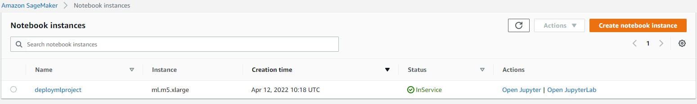
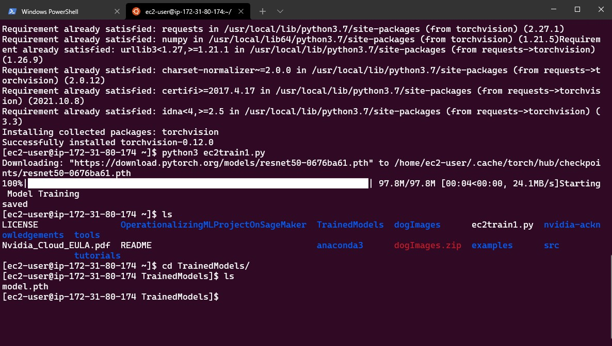
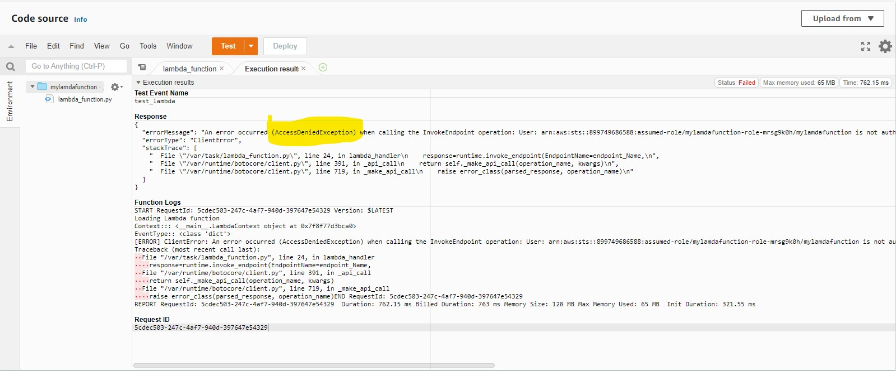
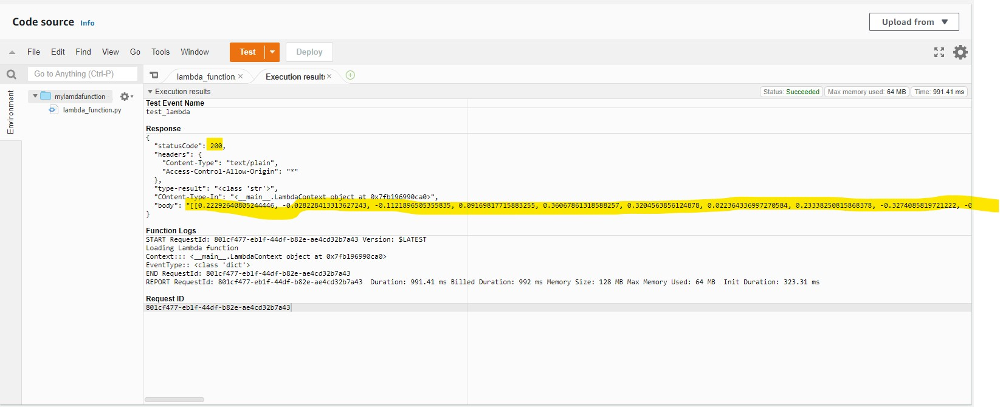
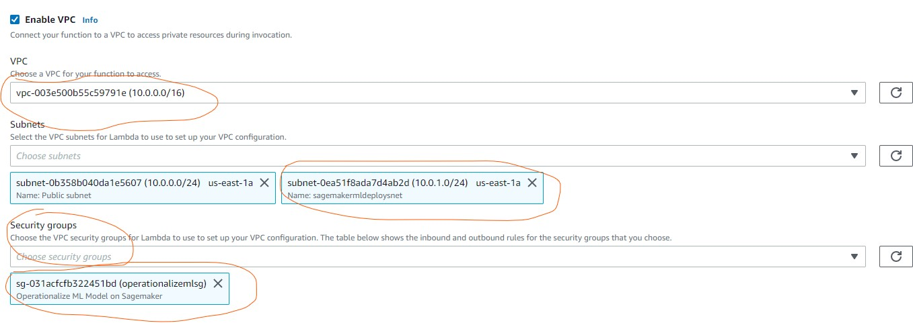
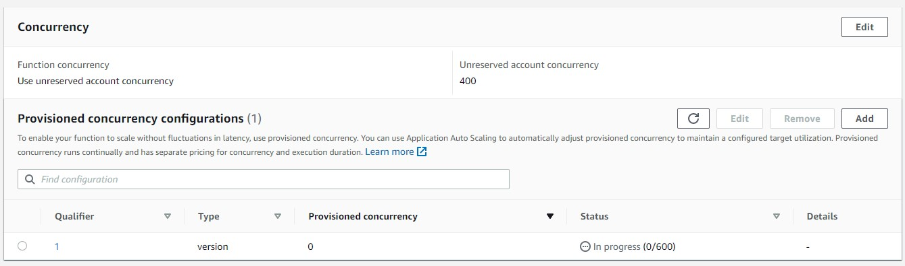
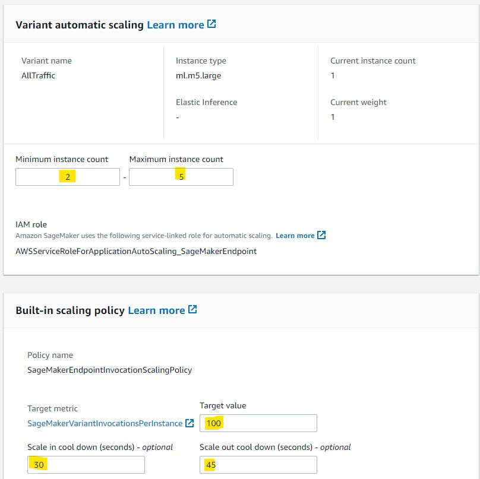

### Sagemaker instance selection choice 

I selected Sagemaker instance ml.m5.xlarge for the following reasons: 
-	When I tried to run a traning job on ml.t3.medium a got job failed upon low memory, so I had to choose other instance.Also the price was affordable for the traning time $0.115 Hour.

### Justification for choosing type of EC2 instance
I went with ml.m5.xlarge EC2 instance because this image provides good CPU and Memory requirements sufficient to run data processing, basic operations and model training.
the  Price per hour is less than $0.115 which is good cost tradeoff.   

### Write about EC2 code and how it compares to the code from Step 1
Listed below are key difference between EC2 code and Sagemaker instance code 
-	Several sagemaker modules and libraries are available in sagemaker notebook environment which are not available in EC2 instance. 
-	In some instance i had to install some libriries no EC2 instance so that the script can run sucessfully.  
-	EC2 code is simple python environment with pytorch support.  
-	Entire ML pipeline can be executed on Sagemaker which we can afford on EC2 instance. 
-   In general is more easy to get up and runnig enviroment on Sage maker than on EC2, even testing is easy on sagemaker.

### Write about Lambda function in final writeup. 
In Lambda function we instantiate runtime object and endpoint_name. Runtime object is used to invoke the endpoint and accepts the format of event message such as ‘application/json’ referring to json format for request body content. Result returned from the endpoint is converted into JSON format before being send back in response body with status code of ‘200’. 
Results:

    

## Writeup about whether you think your AWS workspace is secure, and whether you think there are any vulnerabilities
Observation from Security perspective:
-	We have enabled Sagemaker full access for Lambda function which can be further restricted to limited Sagemaker resources such as endpoint so that other sagemaker resources can be secured from lambda function execution. 
-	I have launched EC2 in default VPC and I created a specific Security Croup Police and I allowed only my laptop ip to connect the resources.
  

### Configuration of Concurrency and Auto-Scaling
Concurrency is the number of requests that your function is serving at any given time. When your function is invoked, Lambda allocates an instance of it to process the event. When the function code finishes running, it can handle another request. If the function is invoked again while a request is still being processed, another instance is allocated, which increases the function's concurrency. The total concurrency for all of the functions in your account is subject to a per-region quota.
So to this project I setep 600 just for testing. In the real world this can var according the number of requests.
  
I had to configure a version for the lambda function and then published It. Once the version is available. I decided to go with max 5 and mi 2 as I do not expect heavy traffic or workload.For the scale out cool donw I configure 30 secs so that that can be quick on scale in and take a litle time more on scale out. An the this is trigered  whet the andpoint receives a 100 concurent connections.
  

 
References:
![online] Available at: <https://docs.aws.amazon.com/lambda/latest/dg/configuration-concurrency.html> [Accessed 24 April 2022].

